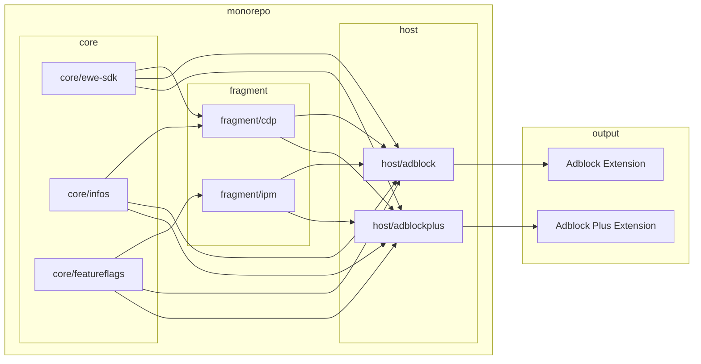

# Eyeo Web Extensions Monorepo

## The Monorepo Architecture

The extension fragments architecture aims to provide a structured method for
developing complex browser extensions with a focus on adaptability and
scalability. It facilitates the integration of smaller, specialized components
called 'fragments' into the host extension, in order to create customized
extensions with different features and branding to suit various user needs.

This architecture also streamlines dependency management, making development and
collaboration more efficient.  

## Main architectural components

There are three main types of architectural components:

| Component type | Owner           |
|:---------------|:----------------|
| Core utilities | Extensions team |
| Fragment       | Any             |
| Host extension | Extensions team |

### Core utilities

Core functionality that any extension fragment can rely on. They help to
establish consistency in practices, discourage usage of unsafe APIs, and reduce
duplication.

Examples: feature flags, APIs to obtain browser and extension information.

### Fragment

Encapsulation of business logic and functionality, to enable modular development
and easy maintenance within the broader extension ecosystem.

A fragment is an NPM package that can be imported into an extension, which may
contain code that runs in the background, content-scripts, UI Fragments, UI
logic, etc; but it is not an extension on its own.

The package does not need to be published to an NPM repository, it can simply be
imported locally within the monorepository.

A fragment can be able to run in a standalone manner, outside a host extension
but that is irrelevant for integration purposes.

Examples: Readership Link, In-product messaging (IPM).

### Host extension

The extension that composes core packages and extension fragments together. What
we ship to the stores.

Examples: AdBlock, AdBlock Plus.

### Component relationship

The diagram below illustrates the interactions between the different types of
components:



## CI pipeline

### Runners

Pipeline jobs use self-managed runners from Google Cloud Platform (GCP). The
the setup of the runner is defined in [the devops runner project](https://gitlab.com/eyeo/devops/terraform/projects/gitlab-runners/terraform-adblock-inc-runner/), and the runner status can be checked
[here](https://gitlab.com/groups/eyeo/extensions/-/runners). Access to GCP
resources like the GCloud console can be granted by devops as well.

## Release notes

We want to simplify the process of submitting changes to the various web stores. Therefore, any commit that has any impact on the user facing deployable things (found in `hosts/`) should have release notes. This means adding items to the `Unreleased` section in relevant `hosts/*/RELEASE_NOTES.md` files.

### What does this mean for me as a person creating a merge request? 

Assuming your changes have an impact on the extensions in a visible/feature way, please summarize those changes to relevant `RELEASE_NOTES.md` files. For example:

```
# Unreleased

- Updated the thing to be different. (EXT-77)
- Fixed the way we do that other thing to be much faster. (EXT-324)
```

### What does this mean for me as a reviewer of a merge request? 

If you see a change that should probably have release notes, shout!

### What does this mean for me as a person doing the release? 

The specifics will be defined in the release process, but on a high level the release manager is reviewing existing release notes and giving them a version number, not writing them from scratch.