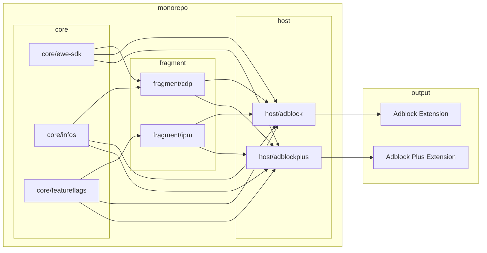

# The Monorepo Architecture

## Main architectural components

There are three main types of architectural components:

| Component type | Owner           |
|:---------------|:----------------|
| Core utilities | Extensions team |
| Fragment       | Any             |
| Host extension | Extensions team |

### Core utilities

Core functionality that any extension fragment can rely on. They help to
establish consistency in practices, discourage usage of unsafe APIs, and reduce
duplication.

Examples: feature flags, APIs to obtain browser and extension information.

### Fragment

Encapsulation of business logic and functionality, to enable modular development
and easy maintenance within the broader extension ecosystem.

A fragment is an NPM package that can be imported into an extension, which may
contain code that runs in the background, content-scripts, UI Fragments, UI
logic, etc; but it is not an extension on its own.

The package does not need to be published to an NPM repository, it can simply be
imported locally within the monorepository.

A fragment can be able to run in a standalone manner, outside a host extension
but that is irrelevant for integration purposes.

Examples: Readership Link, In-product messaging (IPM).

### Host extension

The extension that composes core packages and extension fragments together. What
we ship to the stores.

Examples: AdBlock, Adblock Plus.

### Component relationship

The diagram below illustrates the interactions between the different types of
components:

