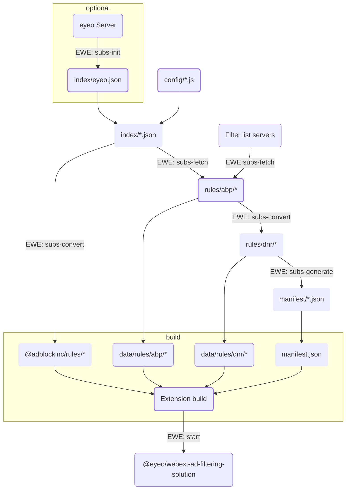

# @adblockinc/rules

@adblockinc/rules is an NPM package for retrieving, storing and providing filter
lists from various sources for use in AdBlock and Adblock Plus.

## Requirements

- Node >= 18
- npm >= 8
- @eyeo/webext-ad-filtering-solution >= 1.1.1

## Setup

Run `npm install`.

## Usage

### Update rules

1. Run `npm run update {adblock|adblockplus}`.
2. Commit updated content of "data" directory.
3. Update dependency in the extension repository.

### Build distribution files

Run `npm run build {adblock|adblockplus}`.

### Integration into extension builds

In the extension repository:

1. Run `rules {adblock|adblockplus}`.
2. Build extension using generated files:
    - Include content of `dist/manifest/*.json` in manifest.json file.
    - Include `dist/rules/abp/*` in build as `data/rules/abp/*`.
    - Include `dist/rules/dnr/*` in build as `data/rules/dnr/*`.
    - Pass content of `dist/index/*.json` to `EWE.start()`.  
      _Note: The index file can also be accessed via @adblockinc/rules/* (e.g.
      `import index from "@adblockinc/rules/adblockplus`)._

## Content

|Location|File|Content|Curation|
|-|-|-|-|
|build|config/*.js|Product-specific list of recommended filter lists|manual|
|data / dist[^data]|index/eyeo.json|Index of available filter lists provided by eyeo|[automatic](#usage)|
|data / dist[^data]|index/*.json|Index of product-specific filter lists|[automatic](#usage)|
|data / dist[^data]|manifest/*.json|Product-specific manifest file fragments|[automatic](#usage)|
|data / dist[^data]|rules/abp/*|Filter list files (Adblock Plus syntax)|[automatic](#usage)|
|data / dist[^data]|rules/dnr/*|Filter list files (declarativeNetRequest syntax) and \*.map files|[automatic](#usage)|

[^data]: Files that are stored in repository are located in "data" directory,
whereas temporary files are located in "dist" directory.

### Filter list data generation

