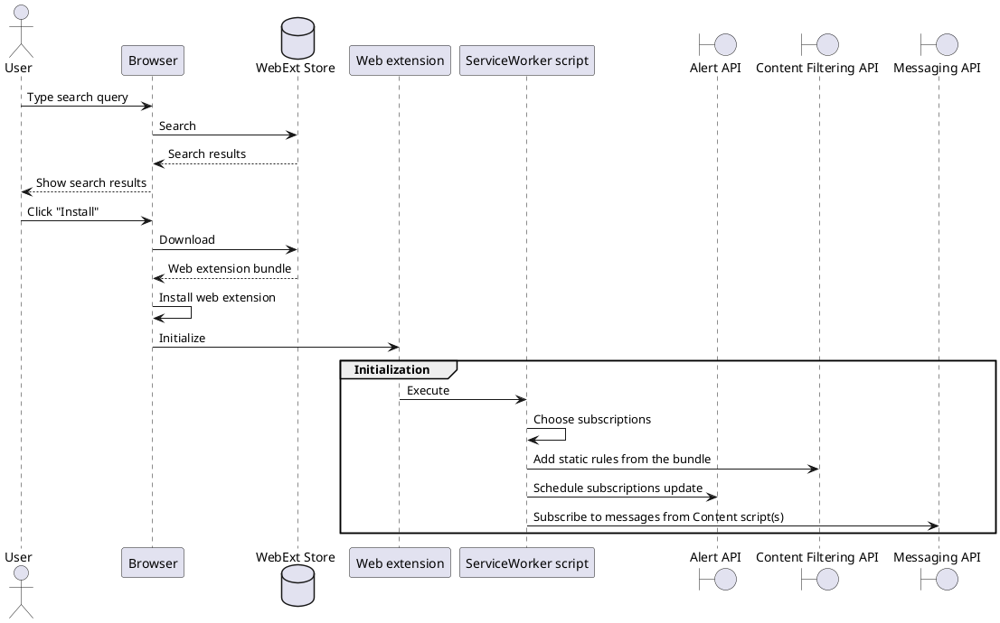
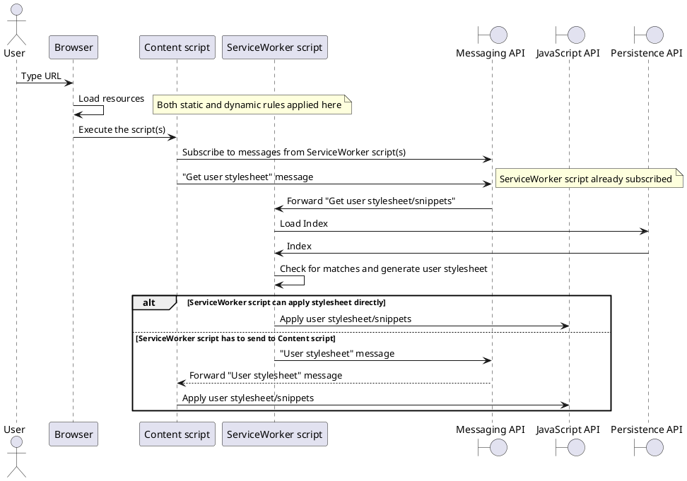
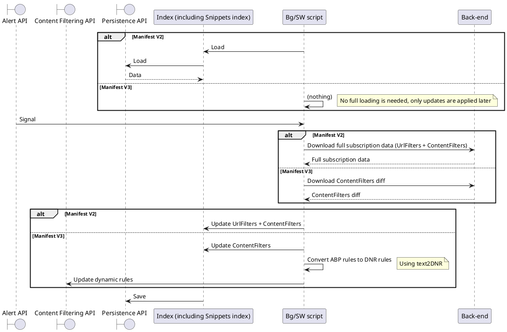
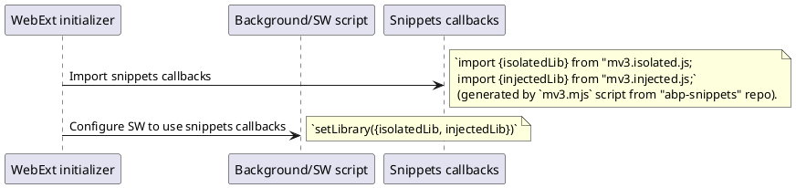
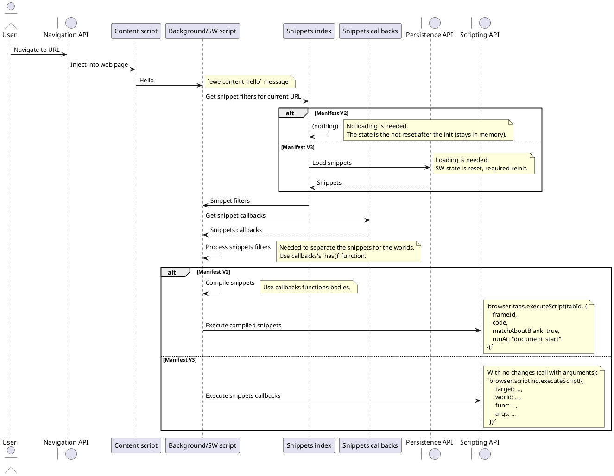

<!-- markdownlint-disable line-length -->
# C4 model for Manifest V3 changes for ad blocking extension

When this document changes, please also update [Confluence](https://confluence.eyeo.com/display/ESDK/5.+ABC+Product+Design).

# Architecture

## Context

eyeo provides a Web extension Ad-Filtering Solution which is used in different
ad filtering web extensions for desktop browsers. Browser extensions keep the
filter subscriptions up-to-date by requesting updates from the filters back end
which is developed and supported by the **FLOPS team**.

```plantuml
@startuml
!include https://raw.githubusercontent.com/plantuml-stdlib/C4-PlantUML/master/C4_Context.puml 
!include https://raw.githubusercontent.com/plantuml-stdlib/C4-PlantUML/master/C4_Container.puml

LAYOUT_WITH_LEGEND()
title Context diagram

' persons
Person(user, "User", "Desktop users")
Person(eeDevs, "WebExt ad-filtering Solution developers")
Person(webExtDevs, "WebExt developers")
Person(snippetDevs, "Snippets/ML developers")
Person(filterEngs, "Filter engineers")
Person(ops, "Operations developers")
Person_Ext(filterDevs, "Filter developers")
Person_Ext(storeModerators, "Store moderators")

' system itself
System(browser, "Desktop browser")
Container(webExt, "Web extension", "JavaScript", "Ad blocking web extension")
System(backEnd, "Filters back-end", "Filter subscriptions back-end")

' ext systems
System_Ext(webExtStore, "WebExt Stores", "eg. Chrome, FF, etc")
System_Ext(websiteHosting, "Websites hosting", "Hosts the websites")
ContainerDb_Ext(gitRepo, "Public filter rules repositories", "Git")

' relations
Rel_R(user, browser, "Searches a web extension, initiates a navigation")
Rel_U(browser, websiteHosting, "Navigates to web sites", "HTTP")
Rel_R(eeDevs, webExtDevs, "Provide WebExt ad-filtering Solution")
Rel_U(snippetDevs, webExtDevs, "Provide snippets and ML model and lib")
Rel_U(webExtDevs, webExtStore, "Publish to")
Rel_R(webExtDevs, webExt, "Develop")
Rel_D(browser, webExtStore, "Installs a web extension from")
Rel_R(webExtStore, webExt, "Hosts")
Rel_D(browser, webExt, "Has installed")
Rel_U(storeModerators, webExt, "Review")
Rel(storeModerators, webExtStore, "Approve to")
Rel_U(filterEngs, backEnd, "Develop")
Rel_U(ops, backEnd, "Develop and scale")
Rel_U(filterDevs, gitRepo, "Publish subscriptions updates to")
Rel_R(webExt, backEnd, "Requests subscriptions updates from", "HTTP")
Rel_R(backEnd, gitRepo, "Fetches the changes from", "Git")
@enduml
```

### Code-centric Context

eyeo has a long successful history of deploying the AdBlock Plus
browser extension using previous manifest versions. While the focus on
Manifest V3 is around the Manifest V3 extension is isolation, the code
repositories and development teams are still structured to support
maintenance of the Manifest V2 extension which will continue to be
used in Firefox.

```plantuml
@startuml
!include https://raw.githubusercontent.com/plantuml-stdlib/C4-PlantUML/master/C4_Context.puml
!include https://raw.githubusercontent.com/plantuml-stdlib/C4-PlantUML/master/C4_Container.puml

LAYOUT_WITH_LEGEND()
title Code-centric Context diagram

' people
Person(adblockinc, "Adblock Inc")
Person(desktop, "Extension Engine Team")
Person(anticv, "Anti-Circumvention Team")

' system itself
System_Boundary(code, "code repositories") {
Container(ui, "AdBlock Plus UI", "JavaScript")
Container(ewe, "Web extension Ad-Filtering Solution", "JavaScript", "Most of the internal functionality for an adblocking browser extension. Supports both V2 and V3 manifest formats.")
Container(core, "AdBlock Plus Core", "JavaScript", "Environment-agnostic adblocking logic. Mostly developed with MV2 constraints in mind and so might not all support MV3 constraints.")
Container(snippets, "Snippets", "JavaScript", "Code that can be executed as snippet filters")
}

Container_Ext(firefox_ext, "Firefox Extension", "build artifact", "Bundles only the parts of the code required for MV2")
Container(chrome_ext, "Chrome Extension", "build artifact", "Bundles only the parts of the code required for MV3")

' relations
Rel(adblockinc, ui, "develops")
Rel(adblockinc, firefox_ext, "bundles and submits to Firefox Web Store")
Rel(adblockinc, chrome_ext, "bundles and submits to Chrome Web Store")
Rel_R(desktop, ewe, "develops")
Rel_R(desktop, core, "develops")
Rel_L(anticv, snippets, "develops")

Rel_D(ui, ewe, "uses")
Rel_D(ewe, core, "uses, mostly to support MV2 mode")
Rel_R(ewe, snippets, "uses")


Rel_L(firefox_ext, code, "bundles in MV2 mode")
Rel_D(chrome_ext, code, "bundles in MV3 mode")
@enduml
```

## Containers

### Browser containers

As a deployable thing a web extension is a single file. As a runnable thing a
web extension is separated into **Content script** and **Background script**
which are hosted in separate processes. Once installed a background script
is executed as a _Service worker_. One a new page (tab) is loaded, a content
script is injected into its context. Both scripts are able to communicate
with Browser via public APIs (that are different for script type) and
together via messages. Web extension (background script) fetches the changes
from filters back-end.

```plantuml
@startuml
!include https://raw.githubusercontent.com/plantuml-stdlib/C4-PlantUML/master/C4_Context.puml
!include https://raw.githubusercontent.com/plantuml-stdlib/C4-PlantUML/master/C4_Container.puml
!include https://raw.githubusercontent.com/plantuml-stdlib/C4-PlantUML/master/C4_Component.puml

title Browser containers diagram
LAYOUT_WITH_LEGEND()

' system itself
System_Boundary(browserSystem, "Browser with web extension") {
  Container_Boundary(browserContainer, "Pure browser", "Native") {
    Component_Ext(browserCore, "Content filtering API", "Native")
    Component_Ext(browserApi, "Other API", "Native")
    Component_Ext(index, "Index", "Native")
    Component_Ext(matcher, "Matcher", "Native")
    Component_Ext(loader, "Resource loader", "Native")
    ContainerDb_Ext(persistence, "Persistence API", "Native")
    Component_Ext(schedulers, "Alert API", "Native")
  }

  Container_Boundary(webExtContainer, "Web Extension") {
    Container(webExtContent, "Content script", "JavaScript", "Associated with web page context")
    Container(webExtBackground, "ServiceWorker script", "JavaScript", "Service worker")
  }
}

System_Boundary(backEndContainer, "Filters back-end") {
    Container(backEnd, "Server", "Apache")
}

' relations
Rel_U(webExtBackground, browserCore, "Request matched rules")
Rel_U(webExtBackground, browserCore, "Setup filter rules (DNR mark-up)")
Rel_U(webExtContent, browserApi, "Injects user stylesheet/CSS")
Rel_U(webExtBackground, persistence, "Persists the data in")
Rel_U(webExtBackground, schedulers, "Uses for scheduling")
Rel_U(browserCore, index, "Fills")
Rel_U(matcher, index, "Uses")
Rel_D(loader, matcher, "Allow load resource?")
Rel_L(matcher, browserCore, "Notifies matched rules")
Rel_D(webExtBackground, backEnd, "Fetches the changes from", "HTTP")
Rel_L(webExtBackground, webExtContent, "Communicates with")
@enduml
```

### Back-end containers

```plantuml
@startuml
!include https://raw.githubusercontent.com/plantuml-stdlib/C4-PlantUML/master/C4_Context.puml
!include https://raw.githubusercontent.com/plantuml-stdlib/C4-PlantUML/master/C4_Container.puml
!include https://raw.githubusercontent.com/plantuml-stdlib/C4-PlantUML/master/C4_Component.puml

title Back-end containers diagram
LAYOUT_WITH_LEGEND()

' system itself
System_Boundary(browser, "Browser with web extension") {
  Container(webExt, "Web extension", "JavaScript")
}

System_Boundary(backEndContainer, "Filters back-end") {
  Container(loadBalancer, "Load balancer", "DNS")
  Container(host1, "Host 1", "Apache")
  Container(hostN, "Host N", "Apache")
  Container(filterServer, "Filters origin server", "Python")
}

ContainerDb_Ext(gitRepo, "Public filter rules repositories", "Git")

' relations
Rel_R(webExt, loadBalancer, "Fetches the changes from", "HTTP")
Rel_D(loadBalancer, host1, "Resolves to")
Rel_D(loadBalancer, hostN, "Resolves to")
Rel_D(host1, filterServer, "Get the data from")
Rel_D(hostN, filterServer, "Get the data from")
Rel_R(filterServer, gitRepo, "Fetches the changes from", "Git")
@enduml
```

## Components

### Web extension components

```plantuml
@startuml
!include https://raw.githubusercontent.com/plantuml-stdlib/C4-PlantUML/master/C4_Container.puml
!include https://raw.githubusercontent.com/plantuml-stdlib/C4-PlantUML/master/C4_Component.puml

title Web extension components diagram

' container itself
Container_Boundary(webext, "Web extension") {
  ' core
  Component(analytics, "Analytics", "", "(?)")
  Component(events, "Events", "", "(essentially EventEmitter, wires the components")
  Component(filters, "Filters", "", "(whole classes hierarchy)")
  Component(filterParser, "Filter parser", "", "(essentially Filter.fromText())")
  Component(diffParser, "Diff parser", "", "MV3 diff")
  Component(synchronizer, "Synchronizer")
  Component(downloader, "Downloader")
  Component(dnrConverter, "DNR converter", "", "(converts filters to DNR mark-up")
  Component(matcher, "Matcher", "", "(Searches for filter matches)")
  Component(notifications, "Notifications", "", "(some events from the server)")
  Component(filterStorage, "Filter Storage", "", "(a mix of container and de-/serializer)")
  Component(prefs, "Preferences", "", "(de/-serializer for settings)")
  Component(snippets, "Snippets", "", "(?)")
  ' webext
  Component(firstRun, "First run", "", "(Onboarding)")
  Component(filterComposer, "Filter composer", "", "(?)")
  Component(options, "Options", "", "(?)")
  Component(popup, "Popup", "", "(?)")
  Component(devTools, "DevTools", "", "(?)")

  node index {
    Component(elemHide, "ElemHide + Exceptions")
    Component(elemHideEmu, "ElemHideEmulation")
    Component(snippets, "Snippets")
  }

  Container_Boundary(bundled_subscriptions, "Bundled subscriptions") {
    ComponentDb(sub1_dnr_rules, "Main filter list", "(file in DNR mark-up)")
    ComponentDb(sub2_dnr_rules, "Main+locale filter list", "(file in DNR mark-up)")
  }
}

' external container
Container_Boundary(browser, "Pure browser", "") {
  ContainerDb_Ext(persistence, "Persistence API", "Native")
  Component_Ext(schedulers, "Alert API", "Native")
  Component_Ext(browserCore, "Content filtering API", "Native")
  Component_Ext(ui, "UI", "Native")
}

' external container
Container_Boundary(backEnd, "Filters back-end", "") {
  Container_Ext(server, "Server", "JavaScript")
}

' relations
Rel(synchronizer, downloader, "Uses")
Rel(synchronizer, filterParser, "Uses")
Rel_U(synchronizer, diffParser, "Uses")
Rel_U(synchronizer, schedulers, "Schedules subscriptions/notifications updates")
Rel(synchronizer, dnrConverter, "Uses")
Rel_U(synchronizer, browserCore, "Feeds with dynamic + static rules")
Rel(synchronizer, bundled_subscriptions, "Uses")
Rel(filterParser, filters, "Instantiates")
Rel(filterParser, index, "Fills")
Rel(index, filters, "Contains")
Rel_U(index, persistence, "Is persisted in")
Rel(downloader, server, "Downloads from")
Rel_U(matcher, index, "Uses")
Rel(notifications, downloader, "Uses")
Rel(filterStorage, persistence, "Uses")
Rel(prefs, persistence, "Uses to feed static rules")
Rel(ui, firstRun, "Show")
Rel(ui, filterComposer, "Show")
Rel(ui, options, "Show")
Rel(ui, popup, "Show")
Rel(ui, devTools, "Show")
@enduml
```

### Back-end components

```plantuml
@startuml
!include https://raw.githubusercontent.com/plantuml-stdlib/C4-PlantUML/master/C4_Container.puml
!include https://raw.githubusercontent.com/plantuml-stdlib/C4-PlantUML/master/C4_Component.puml

title Filter origin server components

' container itself
Container_Boundary(webext, "Filter origin server") {
  ' core  
  Component(parser, "Filter parser", "Python (subscriptionParser.py)", "Filter parsing utils")
  Component(validator, "Filter validator", "Python", "Automated filter checks")
  ComponentDb(fileSystem, "File system", "", "Templates, full filter lists, diffs")
  Component(combiner, "Combiner", "Python (combineSubscriptions.py)", "Filter list templating")
  Component(diffGenerator, "Diff generator", "Python (?)", "Filter list diff generator")
}

Container(compressor, "7z", "Executable")
Container(cvs, "hg/git", "Executable")

Container_Boundary(host, "Host N") {
  Container_Ext(syncScript, "Synchronizing script", "?", "Run by Cron")
  ComponentDb_Ext(fileSystemHost, "File system", "", "")
  Container_Ext(httpServer, "HTTP server", "Apache", "Serves the filter lists (full/diff)")
  Container_Ext(analytics, "Analytics", "", "Set of scripts and tools")
}

' external container
ContainerDb_Ext(repo, "Public filter rules repositories", "Mercurial/Git")
Container_Ext(webExt, "Web extension", "JavaScript", "As a part of desktop browser")

' relations
Rel_D(parser, cvs, "Uses")
Rel_L(parser, repo, "Fetches the changes from")
Rel_R(parser, validator, "Validates filters")
Rel_R(validator, combiner, "Send the filters")
Rel_U(combiner, fileSystem, "Uses templates stored in")
Rel_D(combiner, compressor, "Uses")
Rel_U(combiner, fileSystem, "Puts full filter lists to")
Rel_D(diffGenerator, fileSystem, "Gets full filter lists from, puts diff filter lists to")
Rel_L(syncScript, fileSystem, "Fetches the filter updates", "rsync")
Rel_D(syncScript, fileSystemHost, "Stores the filter updates in")
Rel_U(httpServer, fileSystemHost, "Serves the filter updates from")
Rel_U(httpServer, fileSystemHost, "Saves requests logs to")
Rel_L(analytics, fileSystemHost, "Loads and parses requests logs from")
Rel_U(webExt, httpServer, "Requests filter updates", "HTTP")
@enduml
```

## Code

TBD later.

# Use cases

## Web extension installation



## Page navigation



## Subscription update



## Snippets





SnippetFilter is ContentFilter thus snippets update is a part of regular "Subscription update" (see diagram above).

# Open questions

* Should we show Enterprise boundaries? Adblock Inc. - external/internal?
* WebExt on Containers diagram: split into separate containers (runnable things - Content/Background ) or keep single (single deployable thing)?
* Browser on Containers diagram: keep Browser detailed (components)? Describe Chrome processes (main, child, extension)?
* Filters origin server: show processes?

# TODO

* Close open questions
* Review and discuss together with teams
* Describe Components and Code as we go.
