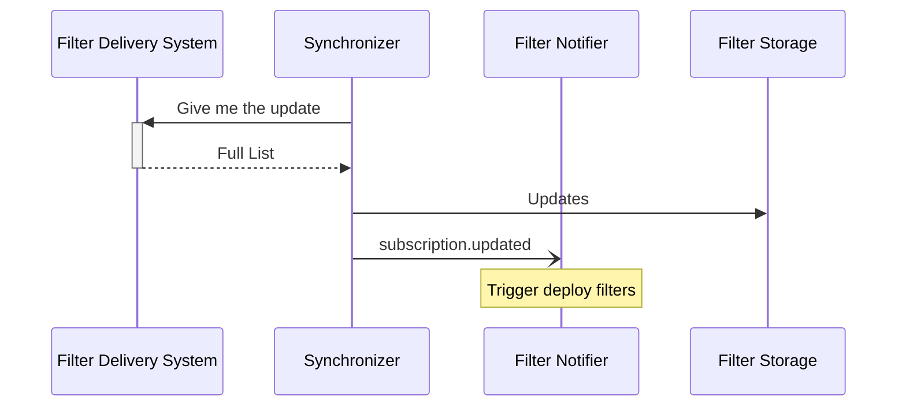
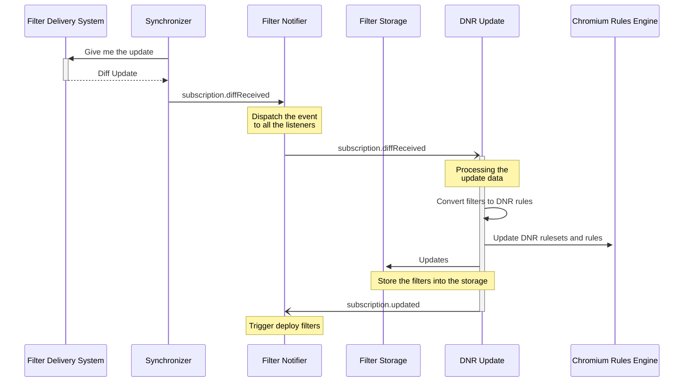
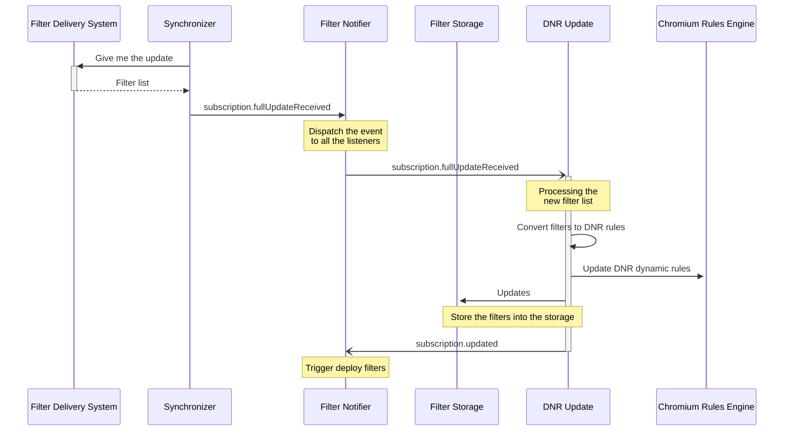

# Ruleset updates

The Manifest V3 request blocking mechanism, _DeclarativeNetRequest_ (DNR)
requires a set of static rules that are provided when the extension is installed
or updated. The static rules cannot be changed without an extension update, only
enabled or disabled. Also in Manifest V3, there is a dynamic ruleset that allow
adding persistent filtering rules, ruleset that has a limit of 30000 rules.

In Manifest V2 all the subscriptions have a URL where to download the
filter list from. The filter list contains all the filters for the
subscription. The update is done by downloading the list and
calculating additions and removal.

All of this is done behind the scene and don't necessitate the Web
Extension to call any API. However the infrastructure to serve
subscriptions must be setup. See [filter delivery
system](https://gitlab.com/eyeo/filters/filterlists-delivery) (note:
private repository).

## Updates in Manifest V2



## Updates in Manifest V3

The updates in Manifest V3 have a more complicated process. They are constrained
by the filter list delivery system that will provide update data built from the
original state and the updated version of the sources, and the limitations on
the number of rules that are imposed by the _DeclarativeNetRequest_ API, which
currently are a maximum 30000 dynamic rules, and 5000 disabled static rules.
Chrome 124+ is required to properly load static rulesets. See this
[related Chromium bug](https://issues.chromium.org/issues/40285683)
for more info.

In Manifest v3 there are two update paths available: DiffUpdatable subscriptions
and FullUpdatable subscriptions.

### DiffUpdatable subscriptions



DiffUpdatable subscriptions are subscriptions passed to the start function.
These subscriptions ship with the extension, with
an associated static ruleset, a filter list, a mapping, and have a separate
URL to get updates (the `diff_url` property).

The update data downloaded from the URL carries the differences from the
installed version to the current version of the filter list. The
`diff_url` property contains the specific version that was
shipped with the extension. The content of the update will change at
the discretion of the filter delivery system.

Internally these subscriptions are instances of
`DiffUpdatableSubscription`. If they don't have a `diff_url` property,
they are of type `CountableSubscription` and are not updated, however the
user counting remains.

The update flow is as follows:

- Download the update from the filter delivery system, from the URL
  in the `diff_url` property.
- Process the update
  - Any static rules that are removed by an update are disabled using
    the DNR API. This API is available from Chrome 111+.
  - Any dynamic rules that are added by an update are added to the dynamic
    ruleset, and count towards the limit.
  - The rules are added to the filter storage and engine.
- In case of error, we rollback to the previous version. For example,
  when we reach the dynamic rules limit.
- Save the state.

On an update of the extension, if the `diff_url` did change, then the
update state for the subscription should be cleared.

The update data (diff) contains filters but our extension ends up using DNR
rules. In order to enable/disable rules, we need to know which filters they map
too. We have mapping files.

#### Mapping

The mapping associated with the ruleset is created when generating the static
ruleset from the filter list (when bundling subscriptions with the
extension). It is a map of fiter text to IDs of rules. This allows identifying
any rules associated with a given filter text.

The mapping is stored as JSON in a `.map` file. The name is the name of the
ruleset (`Subscription.id`) with the `.map` suffix.

#### The update data

The update data comes from the filter delivery system. It is a JSON object that
presents additions and removals from the base filter list that was installed by
the extension. The update data is fetched using the `diff_url`, which contains
both the subscription to update, and the base version to use. It is not
cummulative, which means that at any point resetting to the installation state
and applying the update should lead to the same output.

The response looks like this:

```JSON
{
  "filters": {
    "add": [
    ],
    "remove": [
    ]
  }
}
```

#### Downloading

The download of the update data is done the same way filter lists are
downloaded for Manifest v2 or downloadable subscriptions.

`Synchronizer._onDownloadSuccess` will process the update data in lieu
of the filter list. It will emit `"subscription.diffReceived"` with
the filter notifier.

#### Applying

Applying the difference is done by `dnrDiffSubscriptionUpdate` in the
`dnr-filters.js` module.

It will check for the ability to add the rules checking against the limits. If
it can't, it will bail out and rollback to the previous state.

It will also update the filter storage and the filter engine.

### FullUpdatable subscriptions



FullUpdatable subscriptions are subscriptions added with
`EWE.subscriptions.add()`, which are not bundled with the extension. In other
words, they are the user's custom subscriptions, which the extension developers
don't have any control over.

From a hosting perspective, FullUpdatable subscriptions work the same as MV2
subscriptions. The server needs to respond to GET requests with the full filter
text every time.

All of the DNR rules generated for request filters are dynamic DNR filters, and
so the limits on the number of dynamic DNR filters apply. Custom user
subscriptions are not suitable for large subscriptions in MV3.

## Limitations

- DiffUpdatable subscriptions will only be updated on Chromium 111 or newer.
- Chromium imposes a limit to the number of dynamic rules we can store.
  When this limit is reached, we will no longer update subscriptions if they
  need to add more rules than there is capacity for.
